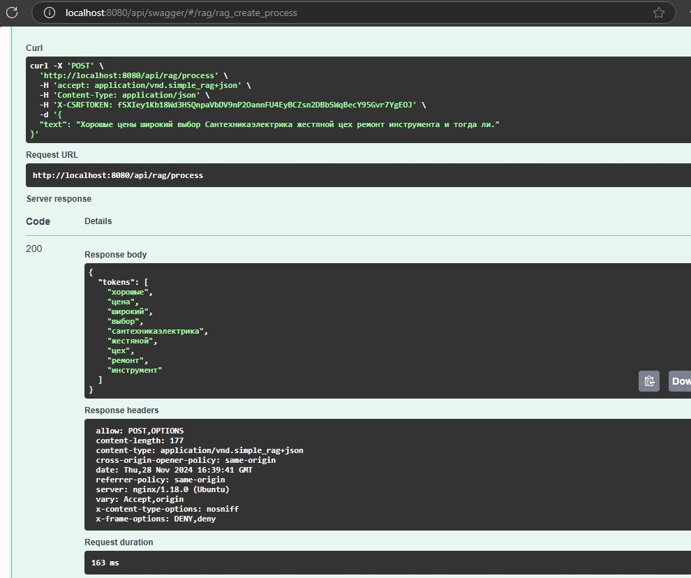
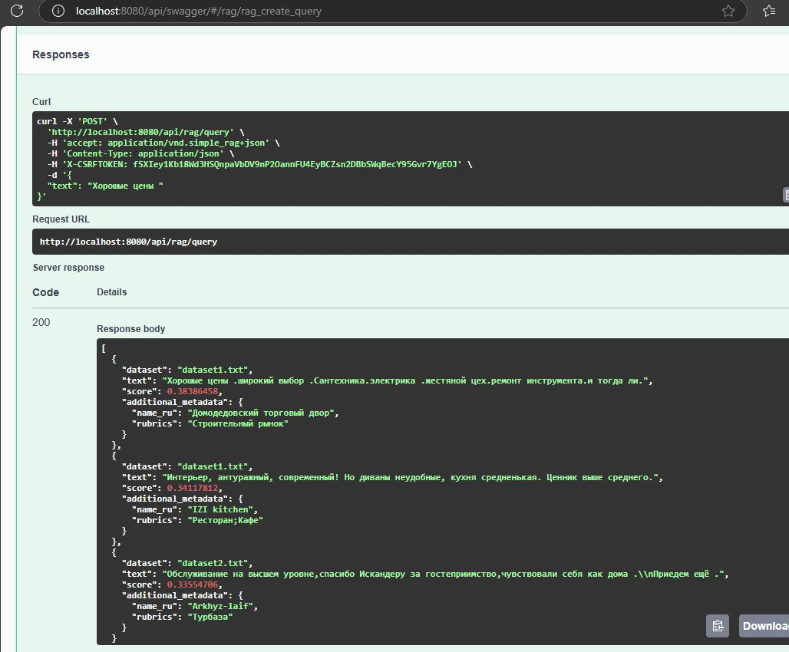

# Simple-RAG

We use [reviews](https://github.com/yandex/geo-reviews-dataset-2023) dataset form Yandex to create a sparse vectors index and a query engine above it. We cleaned the original dataset and generated new datasets located in [datasets folder](./data/datasets/).

### Key Features

1. **Text Processing and Normalization**: [pipeline.py](./simple_rag/apps/core/pipeline.py)
   - Uses `spacy` to generate tokens from texts using the `ru_core_news_sm` model.
   - Implements a function `process_text` to process text and return normalized tokens.
   - Implements a function `process_review` to extract specific fields from review texts.

2. **Sparse Vector Generation**: [pipeline.py](./simple_rag/apps/core/pipeline.py)
   - Uses `scikit-learn`'s `TfidfVectorizer` to generate sparse vectors.
   - Implements functions `sparse_doc_vectors` and `sparse_query_vectors` to compute sparse document and query vectors using TF-IDF.

3. **Text Processing Pipeline**: [pipeline.py](./simple_rag/apps/core/pipeline.py)
   - Defines a text processing pipeline using `llama_index` components.
   - Includes custom components like `CustomTextSplitter` and `ProcessTextTransformer` to split and transform text nodes.

4. **Vector Store and Index**: [qdrant.py](./simple_rag/apps/core/qdrant.py)
   - Uses `qdrant` to store and query the index.
   - Implements functions to create a vector store (`create_vector_store`), create an index (`create_index`), and get an index (`get_index`).

5. **Query Engine**: [qdrant.py](./simple_rag/apps/core/qdrant.py)
   - Implements a function `create_query_engine` to create a query engine using the vector store index.
   - Provides an endpoint to search for the top 3 most relevant texts from the vector database.

6. **API Endpoints**: [views.py](./simple_rag/apps/core/views.py)
   - Defines a `RAGView` class with endpoints to process text and query the vector database.
   - Uses `drf_spectacular` to document the API schema.

7. **CI/CD Workflow**: [github workflow](./.github/workflows/)
   - Defines a CI workflow using GitHub Actions to build, test, and verify the project.
   - Includes steps to build Docker images, run unit tests, and verify the API schema.

8. **Dataset**:
   - Uses the [Yandex geo-reviews dataset](https://github.com/yandex/geo-reviews-dataset-2023) to create a sparse vectors index and a query engine.

9. **Index Creation and Refreshing**: [init_index.py](./simple_rag/apps/core/management/commands/init_index.py)
   - At startup, the application will automatically detect new or changed dataset files and insert them into the index.
   - [split.py](./data/datasets/split.py) can be used to generate datasets from the original Yandex dataset (Not included as it is too large).

### Installation steps

1. Clone the repository to the local computer

```
git clone https://github.com/ibraym/simple-RAG
```

2. Change to the repository folder

```
cd simple-RAG
```

3. Build docker images

```
docker-compose -f docker-compose.yml -f docker-compose.dev.yml build
```

4. Start the docker containers (For the first time it may take some time to build the index)

```
docker-compose up -d
```

5. Access the application through the browser using the link http://localhost:8080/api/swagger

6. Now we can send requests directly from swagger application.

### Example

1. Using swagger application.

   - Process text request:

    

   - Query index request:

   

2. Using Python:

   - Process text request:
   ```
   import requests

    url = 'http://localhost:8080/api/rag/process'
    headers = {
        'accept': 'application/vnd.simple_rag+json',
        'Content-Type': 'application/json',
    }
    data = {
        'text': 'Хорошые цены широкий выбор Сантехникаэлектрика жестяной цех ремонт инструмента и тогда ли.'
    }

    response = requests.post(url, headers=headers, json=data)
    print(response.json())
   ```
   - Query index request:
   ```
   import requests

    url = 'http://localhost:8080/api/rag/query'
    headers = {
        'accept': 'application/vnd.simple_rag+json',
        'Content-Type': 'application/json',
    }
    data = {
        'text': 'Хорошые цены'
    }

    response = requests.post(url, headers=headers, json=data)
    print(response.json())
    ```

### Development Environment

1. Install necessary dependencies (Ubuntu 24.04):
```
sudo apt-get update && sudo apt-get --no-install-recommends install -y build-essential curl git python3-dev python3-pip python3-venv pkg-config apache2-dev
```

2. Install VS Code.

3. Install the following VScode extensions:
   - JavaScript Debugger
   - Python
   - ESLint
   - Stylelint
   - Prettier Formatter for Visual Studio Code
   - licenser
   - Trailing Spaces
   - Code Spell Checker

4. Make sure to use Python 3.10.0 or higher
```
python3 --version
```

6. Setup code
```
git clone git clone https://github.com/ibraym/simple-RAG
cd simple-RAG
python3 -m venv .env
. .env/bin/activate
pip install -U pip wheel setuptools
pip install \
    -r simple-rag/requirements/development.txt \
    -r simple-rag/requirements/production.txt
python manage.py migrate
python manage.py collectstatic
python -m spacy download ru_core_news_sm
```

7. To run test, run the following command inside simple-RAG folder:

```
python manage.py test --settings simple_rag.settings.testing simple_rag/apps/
```

### License

The code is released under the MIT License.


